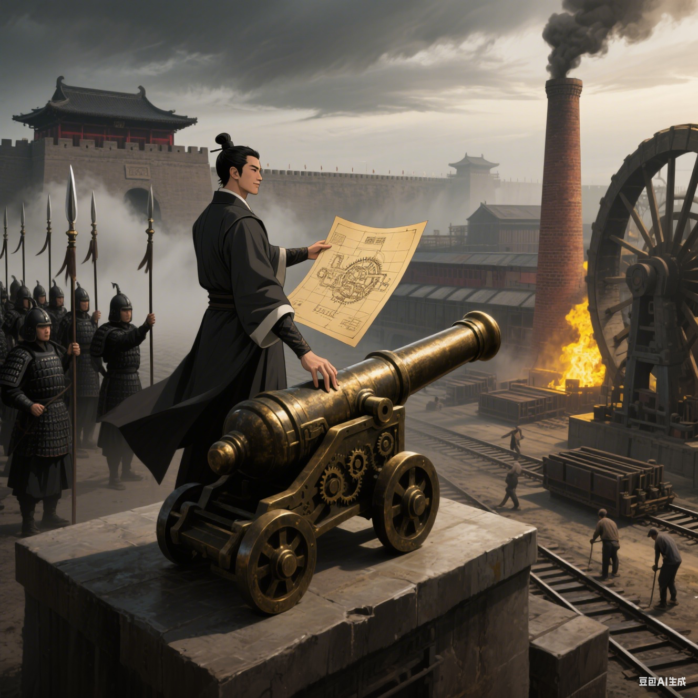

# 重生之我在大秦搞基建

> 一名现代化工销售员，魂穿秦朝死囚，凭借残缺的未来科技数据库，掀起一场工业革命，建立日不落全球帝国的史诗级爽文。

- 👉 **[开始阅读](./content/01-开局被退婚.md)**

- 🎧 **在[喜马拉雅](https://www.ximalaya.com/album/97928860)收听**

本小说由 Gemini Cli 完成，采用 gemini-2.5-pro 模型，历时 2 小时 55 分钟，实际工作时间 1 小时 14 分钟。

```usage
Interaction Summary
Tool Calls:                 123 ( ✔ 123 ✖ 0 )
Success Rate:               100.0%

Performance
Wall Time:                  2h 55s
Agent Active:               1h 14m 32s
  » API Time:               1h 14m 28s (99.9%)
  » Tool Time:              3.6s (0.1%)

Model Usage                  Reqs   Input Tokens  Output Tokens
───────────────────────────────────────────────────────────────
gemini-2.5-pro                195     16,294,796        258,834
```

## 故事简介

现代化工销售员高哲，魂穿秦末，开局死囚。绝境中，他激活了来自未来的科技数据库，从此开启逆天之路。蒸烈酒、造水泥、炼钢铁、研发燧发枪……凭借超越时代的知识，他从一座不毛之地开始，建立起自己的工业帝国。斗权臣、平六国、征服世界、殖民全球。这是一场极致的技术降维打击。看主角如何用钢铁和火焰重铸世界秩序，建立起一个前所未有的日不落大秦帝国……



## 章节目录

*   [第一章：开局被退婚](./content/01-开局被退婚.md)
*   [第二章：咸阳拍卖会](./content/02-咸阳拍卖会.md)
*   [第三章：美人刺客](./content/03-美人刺客.md)
*   [第四章：不毛之地建功业](./content/04-不毛之地建功业.md)
*   [第五章：我的地盘我做主](./content/05-我的地盘我做主.md)
*   [第六章：你管这叫奇技淫巧](./content/06-你管这叫奇技淫巧.md)
*   [第七章：嬴政的死局](./content/07-嬴政的死局.md)
*   [第八章：女王的初次交锋](./content/08-女王的初次交锋.md)
*   [第九章：霸道总裁救美](./content/09-霸道总裁救美.md)
*   [第十章：钢铁洪流](./content/10-钢铁洪流.md)
*   [第十一章：沙丘之变我做主](./content/11-沙丘之变我做主.md)
*   [第十二章：遥望虞姬](./content/12-遥望虞姬.md)
*   [第十三章：霸王别姬我来改](./content/13-霸王别姬我来改.md)
*   [第十四章：我的帝国与女王们](./content/14-我的帝国与女王们.md)
*   [第十五章：帝国的第一次朝会](./content/15-帝国的第一次朝会.md)
*   [第十六章：来自罗马的使者](./content/16-来自罗马的使者.md)
*   [第十七章：匈奴的冬天](./content/17-匈奴的冬天.md)
*   [第十八章：草原的新秩序](./content/18-草原的新秩序.md)
*   [第十九章：丝绸之路上的枪声](./content/19-丝绸之路上的枪声.md)
*   [第二十章：来自波斯的客人](./content/20-来自波斯的客人.md)
